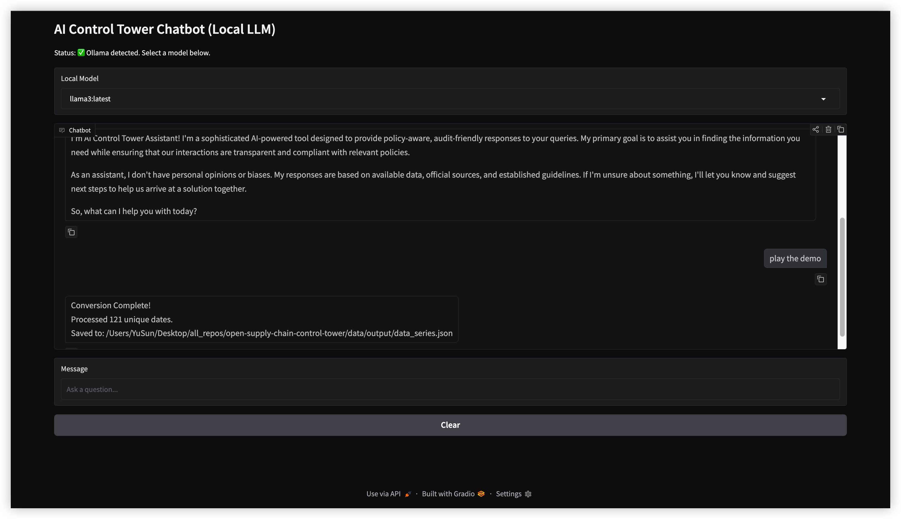

# 🤖 AI Control Tower: U.S. Supply-Chain Resilience (v2.3.0)
[](https://doi.org/10.5281/zenodo.18530096)
[](https://www.python.org/)
[](https://docs.pydantic.dev/)
[](https://github.com/Resilient-Supply-Chain/open-supply-chain-control-tower/commits/main)
[](https://opensource.org/licenses/MIT)

> **"Quantifying fragility, orchestrating defense."** 🛡️

The **AI Control Tower** is a technical reference implementation architected to operationalize the **S.257 (Promoting Resilient Supply Chains Act of 2025)**. This system acts as a proactive "nerve center" for U.S. supply-chain defense, specifically focused on protecting **Small and Medium-Sized Enterprises (SMEs)** from cascading disruptions through automated risk signal interpretation and reporting.

---

## 🏗️ v2.3.0 Release: Multi-Agent Orchestration (Demo)

The **v2.3.0** release introduces a multi-agent orchestration layer. In demo mode, the chatbot can invoke specialized agents to transform registered provider data into UI-ready artifacts for the Vercel frontend.

### 🚀 Project Vision
An AI-powered control tower for U.S. SME supply-chain resilience aligned with **S.257** and **E.O. 14123**—delivering audit-ready policy intelligence and actionable geospatial disruption analysis.

### 🧩 Key Features (v2.3.0)
* **Multi-Agent Chatbot**: A controller agent that routes tasks to specialized agents on demand.
* **AWS SES Resilience Alerts**: Automated, high-risk broadcast system capable of aggregating regional threats into consolidated reports for government stakeholders.
* **Demo-Mode Orchestration**: Currently supports demo mode only, with deterministic, auditable outputs.
* **Provider Data Conversion**: Converts registered provider CSV data into UI-ready JSON for Vercel.
* **Mathematical Foundation**: Haversine and geodesic distance calculations remain available for legacy workflows.

### 📐 Design Philosophy
As a **PhD in AI expert-led** project, our engineering choices prioritize mathematical rigor and auditability over generic automation:
1.  **Determinism over Hallucination**: LLMs are strictly utilized for narrative synthesis. Critical logic—such as geographic mapping and financial impact thresholding—is handled by deterministic Python tools.
2.  **Standardized Telemetry**: All incoming risk signals are normalized to a consistent $[0, 1]$ risk scoring model, allowing for cross-vector analysis (e.g., comparing a cyber-attack to a flood event).
3.  **Security-First Development**: Every contribution is cryptographically signed via SSH/GPG to ensure the integrity of the software supply chain.

---

## ⚖️ Policy & Legislative Alignment

This project is built to move the "Promoting Resilient Supply Chains Act" from legislative text into a functional deployment.

* **S.257 (Promoting Resilient Supply Chains Act of 2025)**: Directly operationalizes the "Early Warning" system and "Vulnerability Mapping" mandates currently being reviewed by the House.
* **EO 14017 (America's Supply Chains)**: Aligns with the executive mandate to strengthen the resilience of critical supply chains, including high-capacity batteries and critical minerals.
* **EO 14110 (Safe, Secure, and Trustworthy AI)**: Adheres to the latest standards for **AI Risk Management** in critical infrastructure, ensuring transparency and robustness in autonomous decision-support.

---

## 📊 Example Output: Chatbot Demo (v2.3.0)

In v2.3.0, the chatbot can trigger a demo agent that converts registered provider data into UI-ready JSON for the Vercel frontend.

```text
demo

Conversion Complete!
   Processed 121 unique dates.
   Saved to: data/output/data_series.json
```


## 🚀 Local Setup (macOS)
Follow these steps to initialize the developer preview on your local machine.

1. **Initialize Virtual Environment**
Ensure you are using Python 3.13.2 for the latest performance and security patches.

```
# Create the local closure
python3 -m venv .venv

# Activate the environment
source .venv/bin/activate
```

2. **Install Dependencies
Sync with Pydantic v2 and the PydanticAI framework.

```
pip install -r requirements.txt
```

3. **Set Environment Variables**
Copy the example file and replace dummy keys as needed:
```
cp .env.example .env
```
Key sources:
- **LlamaParse**: https://cloud.llamaindex.ai/ (LLAMA_CLOUD_API_KEY)
- **Anthropic**: https://console.anthropic.com/ (ANTHROPIC_API_KEY)
- **Hugging Face**: https://huggingface.co/settings/tokens (HUGGINGFACEHUB_API_TOKEN)
- **AWS SES**: Configure `AWS_ACCESS_KEY_ID` and `AWS_SECRET_ACCESS_KEY` in `.env` or your virtual environment to enable email alerts.

4. **Run v2.3.0 Chatbot**
   
Start the chatbot UI and trigger demo conversion with the keyword `demo`.

```
python3 main.py
```
   Note: v2.3.0 focuses on the chatbot demo flow and provider data conversion.

### 📦 Output Artifacts (v2.3.0)
- **UI-ready JSON**: `data/output/data_series.json`

### 🖼️ Visual Evidence (v2.3.0)


## 🗺️ Roadmap: The Path Beyond v2.3.0

**Target Milestone: v2.4 (The Knowledge Engine) 📅 Est. Release: January 29, 2026**

The next iteration transitions from structural verification to deep knowledge integration:

* [x] **S.257 RAG Integration**: Ingest full legislative text to ground recommendations in specific federal assistance programs.
* [ ] **Live Reasoning Core**: Enable high-fidelity impact analysis via live Claude 3.5 Sonnet API calls.
* [ ] **Multi-Vector Signal Fusion**: Integrate real-time data feeds from **NOAA** (weather) and regional port operations (logistics).
* [ ] **NAICS Expansion**: Update `sme_registry.json` to include 6-digit NAICS codes for granular sectoral risk mapping.

---

**Last Updated:** January 19, 2026

**Lead:** Sebastian Sun (PhD in AI)
**Status:** v2.3.0 Release
