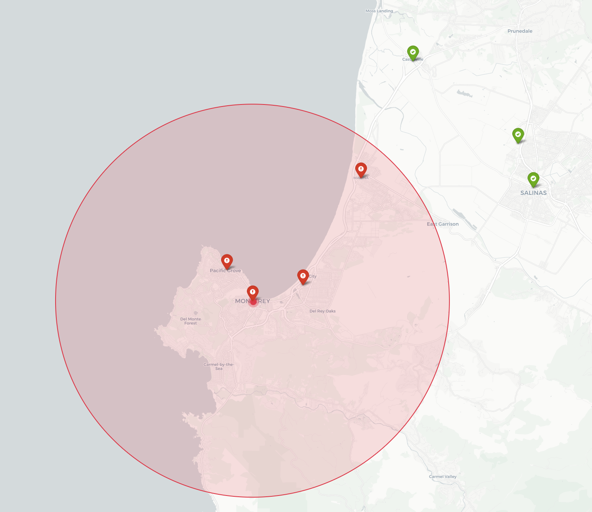

# 🤖 AI Control Tower: U.S. Supply-Chain Resilience (v1.0.0)

[](https://www.python.org/)
[](https://docs.pydantic.dev/)
[](https://github.com/Resilient-Supply-Chain/open-supply-chain-control-tower/commits/main)
[](https://opensource.org/licenses/MIT)

> **"Quantifying fragility, orchestrating defense."** 🛡️

The **AI Control Tower** is a technical reference implementation architected to operationalize the **S.257 (Promoting Resilient Supply Chains Act of 2025)**. This system acts as a proactive "nerve center" for U.S. supply-chain defense, specifically focused on protecting **Small and Medium-Sized Enterprises (SMEs)** from cascading disruptions through automated risk signal interpretation and reporting.

---

## 🏗️ v1.0.0 Release: Geo-Intelligence + Policy Grounding

The **v1.0.0** release delivers an end-to-end geo-aware resilience pipeline. It transforms risk signals into policy-aligned reports **and** a spatial risk map for executive decision support.

### 🧩 Core Capabilities
* **📡 Type-Safe Risk Ingestion**: Implements strict `RiskSignal` validation using **Pydantic V2**, ensuring data integrity from diverse sources such as climate events, port closures, or cyber-physical threats.
* **🛰️ Geospatial SME Triage**: Coordinate-based radius filtering that maps physical disruption epicenters to firm-level exposure recorded in the `sme_registry.json`.
* **🗺️ Interactive Risk Map**: A generated HTML map (`outputs/risk_map.html`) that visualizes the epicenter, impact radius, and affected SMEs.
* **🧠 Cognitive Synthesis (Baseline)**: An agentic framework powered by **PydanticAI** that interprets risk vectors (e.g., Soil Saturation) and generates structured Markdown alerts prioritized by impact severity.

### 📐 Design Philosophy
As a **PhD in AI expert-led** project, our engineering choices prioritize mathematical rigor and auditability over generic automation:
1.  **Determinism over Hallucination**: LLMs are strictly utilized for narrative synthesis. Critical logic—such as geographic mapping and financial impact thresholding—is handled by deterministic Python tools.
2.  **Standardized Telemetry**: All incoming risk signals are normalized to a consistent $[0, 1]$ risk scoring model, allowing for cross-vector analysis (e.g., comparing a cyber-attack to a flood event).
3.  **Security-First Development**: Every contribution is cryptographically signed via SSH/GPG to ensure the integrity of the software supply chain.

---

## ⚖️ Policy & Legislative Alignment

This project is built to move the "Promoting Resilient Supply Chains Act" from legislative text into a functional deployment.

* **S.257 (Promoting Resilient Supply Chains Act of 2025)**: Directly operationalizes the "Early Warning" system and "Vulnerability Mapping" mandates currently being reviewed by the House.
* **EO 14017 (America's Supply Chains)**: Aligns with the executive mandate to strengthen the resilience of critical supply chains, including high-capacity batteries and critical minerals.
* **EO 14110 (Safe, Secure, and Trustworthy AI)**: Adheres to the latest standards for **AI Risk Management** in critical infrastructure, ensuring transparency and robustness in autonomous decision-support.

---

## 📊 Example Output: High-Priority Alert

When a critical event is detected (e.g., a high-saturation soil signal in Monterey), the tower generates a structured briefing for policy makers:

```markdown
## 🚨 Supply Chain Alert (HIGH)

- 🧭 **Risk score**: 0.95
- 📍 **Location**: Monterey_Hwy68
- 🧪 **Primary driver**: Soil_Saturation_Critical
- 💰 **Estimated impact**: $15M_Day

- 🏢 **Potentially affected SMEs:**
  - 🔹 Monterey Valley Produce Co. (`MON-AG-001`) — Agriculture, Monterey County (~0.0 km from epicenter)
  - 🔹 Pacific Grove Cold Storage (`MON-COLD-002`) — Cold Storage, Monterey County (~3.1 km from epicenter)
  - 🔹 Seaside Packaging Works (`MON-PKG-002`) — Packaging, Monterey County (~4.0 km from epicenter)
  - 🔹 Marina Logistics Hub (`MON-LOG-002`) — Logistics, Monterey County (~12.5 km from epicenter)

### 🗺️ Geospatial Risk Visualization
SMEs within **15.0 km** of the soil saturation epicenter at (36.6002, -121.8947) are flagged for monitoring.
An interactive map has been generated at `outputs/risk_map.html`.

### 📚 Relevant S.257 Policy Context
🔎 _RAG mode: **ADVANCED (LlamaParse Markdown)**_
The following passages are retrieved from **S.257 – Promoting Resilient Supply Chains Act of 2025**:
- 📄 **Section 28** — 28
  † S 257 ES
  (8) C RITICAL SUPPLY CHAIN .—The term ‘‘crit-1
  ical supply chain’’ means a supply chain for a crit-2
  ical good.

---
📌 _This alert is generated by the AI control tower prototype aligned with S.257 and E.O. 14123 to support U.S. SME supply-chain resilience._
```


## 🚀 Local Setup (macOS)
Follow these steps to initialize the developer preview on your local machine.

1. **Initialize Virtual Environment**
Ensure you are using Python 3.13.2 for the latest performance and security patches.

```
# Create the local closure
python3 -m venv .venv

# Activate the environment
source .venv/bin/activate
```

2. **Install Dependencies
Sync with Pydantic v2 and the PydanticAI framework.

```
pip install -r requirements.txt
```

3. **Run v1.0.0 Simulation**
   
Execute the baseline logic flow to generate your first resilience report.

```
python3 main.py
```
   Note: v1.0.0 includes geospatial radius filtering and an interactive HTML map.

### 📦 Output Artifacts (v1.0.0)
- **Markdown report**: `outputs/monterey_risk_event_report_v001.md`
- **Interactive map**: `outputs/risk_map.html`

Open the map in your browser:
```
open outputs/risk_map.html
```

### 🖼️ Geo Display Screenshot (v1.0.0)

_Replace this image with your attached screenshot of the HTML map._

## 🗺️ Roadmap: The Path Beyond v1.0.0

**Target Milestone: v1.1 (The Knowledge Engine) 📅 Est. Release: January 29, 2026**

The next iteration transitions from structural verification to deep knowledge integration:

* [x] **S.257 RAG Integration**: Ingest full legislative text to ground recommendations in specific federal assistance programs.
* [ ] **Live Reasoning Core**: Enable high-fidelity impact analysis via live Claude 3.5 Sonnet API calls.
* [ ] **Multi-Vector Signal Fusion**: Integrate real-time data feeds from **NOAA** (weather) and regional port operations (logistics).
* [ ] **NAICS Expansion**: Update `sme_registry.json` to include 6-digit NAICS codes for granular sectoral risk mapping.

---

**Last Updated:** January 19, 2026

**Lead:** Sebastian Sun (PhD in AI)
**Status:** v1.0.0 Release